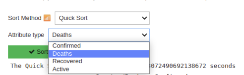
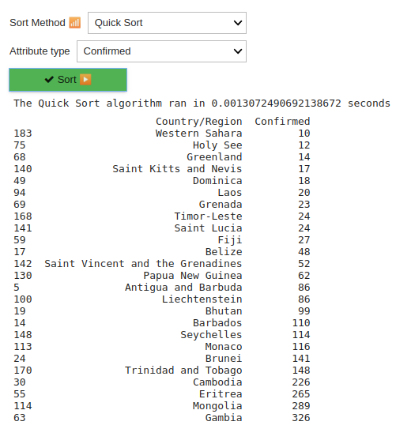
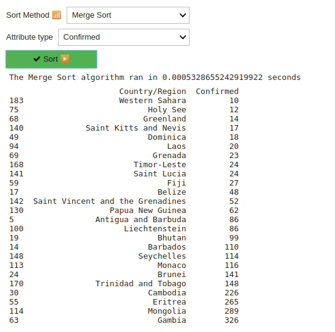

# Covid-19 Stats

**Número da Lista**: 4<br>
**Conteúdo da Disciplina**: Dividir e conquistar<br>

## Alunos
|Matrícula | Aluno |
| -- | -- |
| 17/0138798  |  Caio Fernandes |
| 17/0050939 | Lucas Dutra |

## Sobre 
[Vídeo](https://github.com/projeto-de-algoritmos/D-C_Covid19_stats/blob/master/explicao.mp4)  
Essa aplicação tem como objetivo utilizar dados reais, sobre a COVID-19 disponibilizados na plataforma [Kaggle](https://www.kaggle.com/) e, a partir desses dados, aplicar métodos de ordenação que são implementados utilizando o paradigma de Dividir e Conquistar. A aplicação conta com Merge Sort e Quick Sort como opções de ordenação e, também, é possível selecionar qual atributo a ordenação será aplicada.

## Screenshots
* Colunas disponíveis

* Quick sort

* Merge sort


## Instalação 
**Linguagem**: Python<br>

### Requisitos para executar o projeto
1. [Docker](https://docs.docker.com/get-docker/)
2. [Docker-Compose](https://docs.docker.com/compose/install/)

### Executando o projeto
1. Executar o docker-compose (pode necessitar de permissões de administrador)
    ```
        docker-compose up --build
    ```
2. Acesse, por meio de um navegador o seguinte link
    ```
        http://localhost:8888/
    ```

## Uso 
1. Escolher o método de Ordenação.
2. Escolher a coluna em que o método será aplicado.
3. Clickar no botão "Sort ▶️"

## Outros 
O dado utilizado no projeto está disponível no [Kaggle](https://www.kaggle.com/imdevskp/corona-virus-report?select=country_wise_latest.csv).


